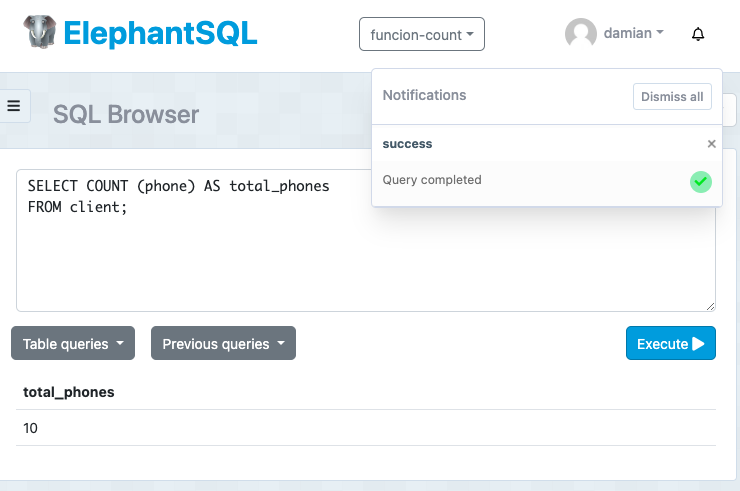

# Tarea en clase semana 8
## La funcion **count**
### Creacion de la tabla 
El siguiente código genera la tabla **client**
```
CREATE TABLE client(
  id SERIAL,
  nui VARCHAR (10) NOT NULL,
  fullname VARCHAR (100) NOT NULL,
  phone VARCHAR (10),
  type_of_client VARCHAR (50) DEFAULT 'BASIC',
  city VARCHAR (50),
  credit_limit DECIMAL (7,2)
);
```

### Inserción de datos
10 registros con todos los campos
```
INSERT INTO client (nui, fullname, phone, type_of_client, city, credit_limit) VALUES
('1104502367', 'Juan Pérez', '0987654321', 'PREMIUM', 'Quito', 5000.00),
('1104567890', 'María Sánchez', '0998765432', 'BASIC', 'Guayaquil', 3000.00),
('1101234567', 'Carlos Gómez', '0976543210', 'BASIC', 'Cuenca', 2000.00),
('1109876543', 'Ana Martínez', '0965432109', 'PREMIUM', 'Guayaquil', 4500.00),
('1105432109', 'Luis Ramírez', '0954321098', 'BASIC', 'Cuenca', 2500.00),
('1106789012', 'Gabriela López', '0943210987', 'BASIC', 'Cuenca', 3500.00),
('1108765432', 'Pedro Torres', '0932109876', 'PREMIUM', 'Quito', 4000.00),
('1103456789', 'Sofía Flores', '0921098765', 'BASIC', 'Guayaquil', 3000.00),
('1102345678', 'David Ortiz', '0910987654', 'BASIC', 'Quito', 1500.00),
('1104561237', 'Lucía Rivera', '0909876543', 'PREMIUM', 'Quito', 5500.00);
```
5 registros nulos con phone en nulo

```
INSERT INTO client (nui, fullname, type_of_client, city, credit_limit) VALUES
('1109871234', 'Carmen Vega', 'BASIC', 'Cuenca', 2000.00),
('1108762345', 'Ricardo Castro', 'PREMIUM', 'Guayaquil', 4500.00),
('1107653456', 'Elena Ruiz', 'BASIC', 'Guayaquil', 3000.00),
('1106544567', 'Javier Salazar', 'BASIC', 'Cuenca', 2500.00),
('1105435678', 'Natalia Mendoza', 'PREMIUM', 'Guayaquil', 5000.00);
```

### Count

- Total de nombres

Para mostrar todos los nombres usamos la funcion `COUNT ()` pasandole el parametro como el campo, en este caso *fullname*
```
SELECT COUNT (fullname) AS total_names
FROM client;
```


- Total de teléfonos

Para mostrar todos los teléfonos usamos la funcion `COUNT ()` pasandole el parametro como el campo, en este caso *phone*
```
SELECT COUNT (phone) AS total_phones
FROM client;
```


- Total de nombres y teléfono

Para mostrar todos los nombres y teléfonos usamos la funcion `COUNT ()` pasandole el parametro como el campo, en este caso *fullname, phone*
```
SELECT COUNT (phone) AS total_phones, COUNT (fullname) AS total_names
FROM client;
```


- Total de nombres y teléfono, con asteristo

Para mostrar todos los nombres, telefonos y total usamos la funcion `COUNT ()` pasandole el parametro como el campo, en este caso *fullname, phone y el asterisco*
```
SELECT COUNT (phone) AS total_phones, COUNT (fullname) AS total_names, COUNT (*) AS total
FROM client;
```


- Ciudades con `DISTINCT` (evitar duplicados)

Para mostrar todas las ciudades usamos la funcion `COUNT ()` pasandole el parametro como el campo, en este caso *city*, y para que no se repita utilizamos el `DISTINCT`.

```
SELECT COUNT (DISTINCT city) AS total_cities
FROM client;
```
